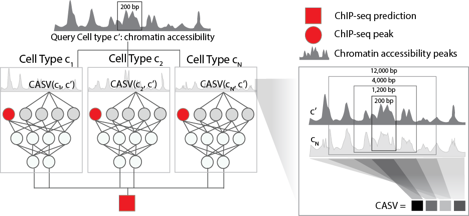

.. epitome documentation master file, created by

Introduction
============

Epitome is a computational model that leverages chromatin accessibility data to predict ChIP-seq peaks on unseen cell types. Epitome computes the chromatin similarity between 11 cell types in ENCODE and the novel cell types, and uses chromatin similarity to transfer ChIP-seq peaks in known cell types to a novel cell type of interest.

.. toctree::
   :caption: Installation and Configuration
   :maxdepth: 2

   installation/source
   usage/dataset

.. toctree::
   :caption: Usage and Examples
   :maxdepth: 2

   usage/dataset
   usage/train
   usage/predict
   usage/create_dataset
   usage/api

Indices and tables
==================

* :ref:`genindex`
* :ref:`modindex`
* :ref:`search`
